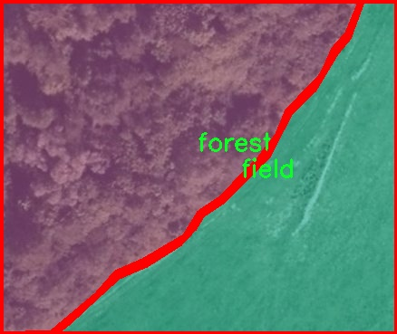

# 遥感图森林与建筑物等区域分割系统源码＆数据集分享
 [yolov8-seg-ContextGuidedDown＆yolov8-seg-EfficientHead等50+全套改进创新点发刊_一键训练教程_Web前端展示]

### 1.研究背景与意义

项目参考[ILSVRC ImageNet Large Scale Visual Recognition Challenge](https://gitee.com/YOLOv8_YOLOv11_Segmentation_Studio/projects)

项目来源[AAAI Global Al lnnovation Contest](https://kdocs.cn/l/cszuIiCKVNis)

研究背景与意义

随着城市化进程的加快和全球气候变化的加剧，森林和建筑物等区域的有效监测与管理变得愈发重要。遥感技术作为一种高效、便捷的地面信息获取手段，能够为土地利用、生态保护和城市规划等领域提供重要的数据支持。在这一背景下，基于深度学习的图像分割技术，尤其是YOLO（You Only Look Once）系列模型的应用，展现出了良好的前景。YOLOv8作为该系列的最新版本，凭借其高效的实时检测能力和优越的分割性能，成为了研究者们关注的焦点。

本研究旨在基于改进的YOLOv8模型，构建一个针对遥感图像中森林与建筑物等区域的分割系统。该系统将利用一个包含5100幅图像的多类别数据集，涵盖建筑、农田、森林、湖泊和道路等五个类别。这一数据集的丰富性为模型的训练和验证提供了坚实的基础，能够有效提升模型的泛化能力和准确性。通过对遥感图像的精确分割，研究将为森林资源的监测、城市扩展的分析以及生态环境的保护提供科学依据。

在当前的研究中，传统的图像分割方法往往依赖于手工特征提取，难以适应复杂多变的自然环境。而基于YOLOv8的深度学习方法，能够自动学习图像中的特征，从而实现更为精准的区域分割。此外，YOLOv8在处理速度和实时性方面的优势，使得其在实际应用中具有广泛的潜力。通过对YOLOv8的改进，可以进一步提升其在遥感图像分割任务中的表现，使其在多类别识别和边界精确度上达到更高的水平。

本研究的意义不仅在于技术上的创新，更在于其对实际应用的推动。随着遥感技术的不断发展，基于深度学习的图像分割系统将为环境监测、城市规划和资源管理等领域提供强有力的支持。通过对森林和建筑物等区域的精准分割，研究将有助于实现对自然资源的可持续管理，促进生态环境的保护与恢复。此外，该系统的应用还可以为政策制定者提供科学依据，帮助其制定更加合理的土地利用政策，平衡城市发展与生态保护之间的关系。

综上所述，基于改进YOLOv8的遥感图森林与建筑物等区域分割系统的研究，不仅具有重要的学术价值，也具有显著的社会意义。通过推动遥感技术与深度学习的结合，本研究将为实现智能化的土地利用监测和生态环境保护提供新的思路和方法，助力可持续发展的目标。

### 2.图片演示


##### 注意：由于此博客编辑较早，上面“2.图片演示”和“3.视频演示”展示的系统图片或者视频可能为老版本，新版本在老版本的基础上升级如下：（实际效果以升级的新版本为准）

  （1）适配了YOLOV8的“目标检测”模型和“实例分割”模型，通过加载相应的权重（.pt）文件即可自适应加载模型。

  （2）支持“图片识别”、“视频识别”、“摄像头实时识别”三种识别模式。

  （3）支持“图片识别”、“视频识别”、“摄像头实时识别”三种识别结果保存导出，解决手动导出（容易卡顿出现爆内存）存在的问题，识别完自动保存结果并导出到tempDir中。

  （4）支持Web前端系统中的标题、背景图等自定义修改，后面提供修改教程。

  另外本项目提供训练的数据集和训练教程,暂不提供权重文件（best.pt）,需要您按照教程进行训练后实现图片演示和Web前端界面演示的效果。

### 3.视频演示

[3.1 视频演示](https://www.bilibili.com/video/BV1cxyZY7Ejk/)

### 4.数据集信息展示

##### 4.1 本项目数据集详细数据（类别数＆类别名）

nc: 5
names: ['building', 'field', 'forest', 'lake', 'road']


##### 4.2 本项目数据集信息介绍

数据集信息展示

在遥感图像分析领域，尤其是在区域分割任务中，数据集的质量和多样性对模型的性能至关重要。本研究采用的数据集名为“forest-full”，专门用于训练和改进YOLOv8-seg模型，以实现对森林与建筑物等区域的精确分割。该数据集的设计旨在涵盖多种地物类型，以便为模型提供丰富的训练样本，从而提高其在实际应用中的泛化能力。

“forest-full”数据集包含五个主要类别，分别是建筑物（building）、农田（field）、森林（forest）、湖泊（lake）和道路（road）。这些类别的选择不仅反映了遥感图像分析的实际需求，也为模型提供了多样化的学习场景。建筑物类别主要包括城市和乡村的各种建筑结构，这对于城市规划和环境监测具有重要意义。农田类别则涵盖了不同类型的农业用地，能够帮助分析土地利用变化和农业生产情况。森林类别则是本数据集的核心，涉及到不同类型的森林覆盖区域，能够为生态保护和生物多样性研究提供支持。湖泊类别则有助于水资源管理和环境保护，而道路类别则对于交通管理和基础设施建设的监测至关重要。

在数据集的构建过程中，研究团队特别注重样本的多样性和代表性。每个类别的样本均来自不同的地理区域和气候条件，以确保模型在各种环境下的鲁棒性。此外，数据集中的图像经过精心标注，确保每个类别的边界清晰可辨，便于模型进行准确的区域分割。这种高质量的标注不仅提升了模型的训练效果，也为后续的验证和测试提供了可靠的基础。

为了进一步增强模型的学习能力，数据集还包含了不同时间和季节拍摄的图像。这种时间维度的多样性使得模型能够学习到不同季节和天气条件下地物的变化特征，从而提高其在动态环境中的适应性。通过对“forest-full”数据集的深入分析和应用，研究团队希望能够推动遥感图像分析技术的发展，尤其是在森林资源管理、城市发展监测和环境保护等领域的应用。

总之，“forest-full”数据集为训练和改进YOLOv8-seg模型提供了丰富的素材和坚实的基础。通过对建筑物、农田、森林、湖泊和道路等多种类别的综合分析，研究团队不仅能够提升模型的分割精度，还能为遥感图像分析领域的进一步研究提供新的思路和方向。随着数据集的不断完善和模型的持续优化，未来在遥感图像处理中的应用前景将更加广阔。





### 5.全套项目环境部署视频教程（零基础手把手教学）

[5.1 环境部署教程链接（零基础手把手教学）](https://www.bilibili.com/video/BV1jG4Ve4E9t/?vd_source=bc9aec86d164b67a7004b996143742dc)


[5.2 安装Python虚拟环境创建和依赖库安装视频教程链接（零基础手把手教学）](https://www.bilibili.com/video/BV1nA4VeYEze/?vd_source=bc9aec86d164b67a7004b996143742dc)

### 6.手把手YOLOV8-seg训练视频教程（零基础小白有手就能学会）

[6.1 手把手YOLOV8-seg训练视频教程（零基础小白有手就能学会）](https://www.bilibili.com/video/BV1cA4VeYETe/?vd_source=bc9aec86d164b67a7004b996143742dc)


按照上面的训练视频教程链接加载项目提供的数据集，运行train.py即可开始训练



     Epoch   gpu_mem       box       obj       cls    labels  img_size
     1/200     0G   0.01576   0.01955  0.007536        22      1280: 100%|██████████| 849/849 [14:42<00:00,  1.04s/it]
               Class     Images     Labels          P          R     mAP@.5 mAP@.5:.95: 100%|██████████| 213/213 [01:14<00:00,  2.87it/s]
                 all       3395      17314      0.994      0.957      0.0957      0.0843

     Epoch   gpu_mem       box       obj       cls    labels  img_size
     2/200     0G   0.01578   0.01923  0.007006        22      1280: 100%|██████████| 849/849 [14:44<00:00,  1.04s/it]
               Class     Images     Labels          P          R     mAP@.5 mAP@.5:.95: 100%|██████████| 213/213 [01:12<00:00,  2.95it/s]
                 all       3395      17314      0.996      0.956      0.0957      0.0845

     Epoch   gpu_mem       box       obj       cls    labels  img_size
     3/200     0G   0.01561    0.0191  0.006895        27      1280: 100%|██████████| 849/849 [10:56<00:00,  1.29it/s]
               Class     Images     Labels          P          R     mAP@.5 mAP@.5:.95: 100%|███████   | 187/213 [00:52<00:00,  4.04it/s]
                 all       3395      17314      0.996      0.957      0.0957      0.0845


### 7.50+种全套YOLOV8-seg创新点代码加载调参视频教程（一键加载写好的改进模型的配置文件）

[7.1 50+种全套YOLOV8-seg创新点代码加载调参视频教程（一键加载写好的改进模型的配置文件）](https://www.bilibili.com/video/BV1Hw4VePEXv/?vd_source=bc9aec86d164b67a7004b996143742dc)

### 8.YOLOV8-seg图像分割算法原理

原始YOLOv8-seg算法原理

YOLOv8-seg算法是YOLO系列中的最新版本，旨在通过结合目标检测与实例分割的能力，进一步提升计算机视觉任务的性能。自2023年1月10日发布以来，YOLOv8-seg在多个指标上超越了前代模型，成为当前计算机视觉领域中最先进的工具之一。其设计理念源于YOLOv5、YOLOv6和YOLOX等模型的优点，结合了新技术和结构优化，形成了一个高效、精确且易于使用的框架。

YOLOv8-seg的核心在于其独特的网络结构，主要由输入层、Backbone骨干网络、Neck特征融合网络和Head检测模块四个部分组成。输入层负责对图像进行预处理，包括调整图像比例、进行Mosaic增强以及计算瞄点，以确保输入数据的多样性和丰富性。Backbone部分采用了改进的DarkNet结构，其中C3模块被C2f模块所替代。C2f模块通过增加跳层连接和Split操作，显著增强了特征提取的能力，同时保持了轻量级特性。这种结构的变化使得YOLOv8-seg能够更好地捕捉图像中的细节信息，尤其是在处理小目标和高分辨率图像时表现出色。

在特征融合方面，YOLOv8-seg采用了双塔结构的Neck模块，结合了特征金字塔网络（FPN）和路径聚合网络（PAN）。这种设计促进了语义特征与定位特征的有效转移，使得网络能够获取更丰富的特征信息，从而提升对不同尺度目标的检测性能。特征融合的过程通过SPPF模块进行优化，利用不同内核尺寸的池化操作对特征图进行合并，进一步增强了特征的表达能力。

YOLOv8-seg的检测模块是其创新的亮点之一。与之前的YOLO版本不同，YOLOv8-seg采用了解耦头结构，将回归分支和分类分支分离。这一变化不仅加速了模型的收敛速度，还提高了检测的精度和效率。此外，YOLOv8-seg引入了Anchor-Free的检测头，摒弃了传统的Anchor-Based方法，简化了目标检测的过程。这种新颖的设计使得YOLOv8-seg在各种硬件平台上均能高效运行，从CPU到GPU的兼容性使得其应用场景更加广泛。

在损失函数的设计上，YOLOv8-seg也进行了重要的创新。新的损失函数不仅考虑了分类和回归的准确性，还综合了实例分割的需求，确保了模型在进行目标检测的同时，能够精确地分割出目标的轮廓。这一特性使得YOLOv8-seg在处理复杂场景时，能够更好地应对遮挡、重叠等问题，从而提高了整体的检测和分割性能。

YOLOv8-seg在训练过程中采用了多尺度训练和测试策略，进一步提升了模型的鲁棒性和适应性。通过在不同尺度下进行训练，模型能够更好地学习到不同大小目标的特征，从而在实际应用中表现出更高的准确性和稳定性。此外，YOLOv8-seg的训练速度也得到了显著提升，较之前版本在精度和帧率上均有了大幅度的提高，使其在实时应用中更具竞争力。

总的来说，YOLOv8-seg算法通过一系列结构优化和技术创新，成功地将目标检测与实例分割的功能结合在一起，形成了一个高效、精确且易于使用的计算机视觉工具。其在多个应用场景中的优异表现，证明了YOLOv8-seg在推动计算机视觉技术进步方面的重要性。随着YOLOv8-seg的不断发展与完善，未来在智能监控、自动驾驶、人脸识别等领域的应用潜力将更加广阔，为各行各业带来更为精准和高效的解决方案。


### 9.系统功能展示（检测对象为举例，实际内容以本项目数据集为准）

图9.1.系统支持检测结果表格显示

  图9.2.系统支持置信度和IOU阈值手动调节

  图9.3.系统支持自定义加载权重文件best.pt(需要你通过步骤5中训练获得)

  图9.4.系统支持摄像头实时识别

  图9.5.系统支持图片识别

  图9.6.系统支持视频识别

  图9.7.系统支持识别结果文件自动保存

  图9.8.系统支持Excel导出检测结果数据


### 10.50+种全套YOLOV8-seg创新点原理讲解（非科班也可以轻松写刊发刊，V11版本正在科研待更新）

#### 10.1 由于篇幅限制，每个创新点的具体原理讲解就不一一展开，具体见下列网址中的创新点对应子项目的技术原理博客网址【Blog】：


[10.1 50+种全套YOLOV8-seg创新点原理讲解链接](https://gitee.com/qunmasj/good)

#### 10.2 部分改进模块原理讲解(完整的改进原理见上图和技术博客链接)【如果此小节的图加载失败可以通过CSDN或者Github搜索该博客的标题访问原始博客，原始博客图片显示正常】
### 可变性卷积DCN简介
卷积神经网络由于其构建模块中固定的几何结构，本质上受限于模型几何变换。为了提高卷积神经网络的转换建模能力，《Deformable Convolutional Networks》作者提出了两个模块：可变形卷积（deformable convolution）和可变形RoI池（deformable RoI pooling）。这两个模块均基于用额外的偏移来增加模块中的空间采样位置以及从目标任务中学习偏移的思想，而不需要额外的监督。

第一次证明了在深度神经网络中学习密集空间变换（dense spatial transformation）对于复杂的视觉任务是有效的

视觉识别中的一个关键挑战是如何适应对象比例、姿态、视点和零件变形中的几何变化或模型几何变换。一般有两种方法实现：
1）建立具有足够期望变化的训练数据集。这通常通过增加现有的数据样本来实现，例如通过仿射变换。但是训练成本昂贵而且模型参数庞大。
2）使用变换不变（transformation-invariant）的特征和算法。比如比较有名的SIFT(尺度不变特征变换)便是这一类的代表算法。

但以上的方法有两个缺点：
1）几何变换被假定为固定的和已知的，这些先验知识被用来扩充数据，设计特征和算法。为此，这个假设阻止了对具有未知几何变换的新任务的推广，从而导致这些几何变换可能没有被正确建模。
2）对于不变特征和算法进行手动设计，对于过于复杂的变换可能是困难的或不可行的。

卷积神经网络本质上局限于模拟大型未知转换。局限性源于CNN模块的固定几何结构：卷积单元在固定位置对输入特征图进行采样；池化层以固定比率降低特征矩阵分辨率；RoI（感兴趣区域）池化层将RoI分成固定的空间箱（spatial bins）等。缺乏处理几何变换的内部机制。

这种内部机制的缺乏会导致一些问题，举个例子。同一个CNN层中所有激活单元的感受野大小是相同的，但是这是不可取的。因为不同的位置可能对应于具有不同尺度或变形的对象，所以尺度或感受野大小的自适应确定对于具有精细定位的视觉识别是渴望的。

对于这些问题，作者提出了两个模块提高CNNs对几何变换建模的能力。


deformable convolution（可变形卷积）
将2D偏移量添加到标准卷积中的常规网格采样位置，使得采样网格能够自由变形。通过额外的卷积层，从前面的特征映射中学习偏移。因此，变形采用局部、密集和自适应的方式取决于输入特征。


deformable RoI pooling（可变形RoI池化）
为先前RoI池化的常规库（bin）分区中的每个库位置（bin partition）增加了一个偏移量。类似地，偏移是从前面的特征图和感兴趣区域中学习的，从而能够对具有不同形状的对象进行自适应部件定位（adaptive part localization）。

#### Deformable Convolutional Networks
Deformable Convolution
2D卷积由两个步骤组成：
1）在输入特征图x xx上使用规则网格R RR进行采样。
2）把这些采样点乘不同权重w ww后相加。

网格R定义感受野大小和扩张程度，比如内核大小为3x3，扩张程度为1的网格R可以表示为：
R = { ( − 1 , − 1 ) , ( − 1 , 0 ) , … , ( 0 , 1 ) , ( 1 , 1 ) } R = \{(-1,-1),(-1,0),\dots,(0,1),(1,1)\}
R={(−1,−1),(−1,0),…,(0,1),(1,1)}

​
 一般为小数，使用双线性插值进行处理。（把小数坐标分解到相邻的四个整数坐标点来计算结果）


具体操作如图所示：


首先对输入特征层进行一个普通的3x3卷积处理得到偏移域（offset field）。偏移域特征图具有与输入特征图相同的空间分辨率，channels维度2N对应于N个2D（xy两个方向）偏移。其中的N是原输入特征图上所具有的N个channels，也就是输入输出channels保持不变，这里xy两个channels分别对输出特征图上的一个channels进行偏移。确定采样点后就通过与相对应的权重w点乘相加得到输出特征图上该点最终值。

前面也提到过，由于这里xy两个方向所训练出来的偏移量一般来说是一个小数，那么为了得到这个点所对应的数值，会采用双线性插值的方法，从最近的四个邻近坐标点中计算得到该偏移点的数值，公式如下：


具体推理过程见：双线性插值原理

#### Deformable RoI Poolingb
所有基于区域提议（RPN）的对象检测方法都使用RoI池话处理，将任意大小的输入矩形区域转换为固定大小的特征图。


 一般为小数，需要使用双线性插值进行处理。


具体操作如图所示：


当时看这个部分的时候觉得有些突兀，明明RoI池化会将特征层转化为固定尺寸的区域。其实，我个人觉得，这个部分与上述的可变性卷积操作是类似的。这里同样是使用了一个普通的RoI池化操作，进行一些列处理后得到了一个偏移域特征图，然后重新作用于原来的w × H w \times Hw×H的RoI。只不过这里不再是规律的逐行逐列对每个格子进行池化，而是对于格子进行偏移后再池化处理。

#### Postion﹣Sensitive RoI Pooling
除此之外，论文还提出一种PS RoI池化（Postion﹣Sensitive RoI Pooling）。不同于上述可变形RoI池化中的全连接过程，这里使用全卷积替换。

具体操作如图所示：


首先，对于原来的特征图来说，原本是将输入特征图上的RoI区域分成k × k k\times kk×k个bin。而在这里，则是将输入特征图进行卷积操作，分别得到一个channels为k 2 ( C + 1 ) k^{2}(C+1)k (C+1)的得分图（score maps）和一个channels为2 k 2 ( C + 1 ) 2k{2}(C+1)2k 2 (C+1)的偏移域（offset fields），这两个特征矩阵的宽高是与输入特征矩阵相同的。其中，得分图的channels中，k × k k \times kk×k分别表示的是每一个网格，C CC表示的检测对象的类别数目，1表示背景。而在偏移域中的2表示xy两个方向的偏移。
也就是说，在PS RoI池化中，对于RoI的每一个网格都独自占一个通道形成一层得分图，然后其对于的偏移量占两个通道。offset fields得到的偏移是归一化后的偏移，需要通过和deformable RoI pooling中一样的变换方式得到∆ p i j ∆p_{ij}∆p ij，然后对每层得分图进行偏移池化处理。最后处理完的结果就对应着最后输出的一个网格。所以其包含了位置信息。

原文论述为：


#### Understanding Deformable ConvNets
当可变形卷积叠加时，复合变形的效果是深远的。如图所示：


ps：a是标准卷积的固定感受野，b是可变形卷积的适应性感受野。

感受野和标准卷积中的采样位置在整个顶部特征图上是固定的(左)。在可变形卷积中，它们根据对象的比例和形状进行自适应调整(右)。


### 11.项目核心源码讲解（再也不用担心看不懂代码逻辑）

#### 11.1 ultralytics\models\rtdetr\val.py

以下是经过简化和注释的核心代码部分，保留了最重要的功能和结构：

```python
# 导入必要的库
from pathlib import Path
import torch
from ultralytics.data import YOLODataset
from ultralytics.models.yolo.detect import DetectionValidator
from ultralytics.utils import ops

class RTDETRDataset(YOLODataset):
    """
    RT-DETR数据集类，继承自YOLODataset类，专为实时检测和跟踪任务设计。
    """

    def __init__(self, *args, data=None, **kwargs):
        """初始化RTDETRDataset类，调用父类构造函数。"""
        super().__init__(*args, data=data, use_segments=False, use_keypoints=False, **kwargs)

    def load_image(self, i, rect_mode=False):
        """加载数据集中索引为'i'的图像，返回图像及其调整后的尺寸。"""
        return super().load_image(i=i, rect_mode=rect_mode)

    def build_transforms(self, hyp=None):
        """构建图像变换，主要用于评估阶段。"""
        transforms = []
        # 添加格式化变换
        transforms.append(
            Format(bbox_format='xywh', normalize=True, return_mask=self.use_segments,
                   return_keypoint=self.use_keypoints, batch_idx=True,
                   mask_ratio=hyp.mask_ratio, mask_overlap=hyp.overlap_mask))
        return transforms


class RTDETRValidator(DetectionValidator):
    """
    RTDETRValidator类，扩展了DetectionValidator类，提供RT-DETR模型的验证功能。
    """

    def build_dataset(self, img_path, mode='val', batch=None):
        """
        构建RTDETR数据集。

        Args:
            img_path (str): 图像文件夹路径。
            mode (str): 模式（训练或验证）。
            batch (int, optional): 批次大小。
        """
        return RTDETRDataset(
            img_path=img_path,
            imgsz=self.args.imgsz,
            batch_size=batch,
            augment=False,  # 不进行数据增强
            hyp=self.args,
            rect=False,  # 不使用矩形模式
            cache=self.args.cache or None,
            prefix=colorstr(f'{mode}: '),
            data=self.data)

    def postprocess(self, preds):
        """对预测结果应用非极大值抑制（NMS）。"""
        bs, _, nd = preds[0].shape  # bs: 批次大小, nd: 预测维度
        bboxes, scores = preds[0].split((4, nd - 4), dim=-1)  # 分离边界框和分数
        bboxes *= self.args.imgsz  # 将边界框缩放到原始图像尺寸
        outputs = [torch.zeros((0, 6), device=bboxes.device)] * bs  # 初始化输出
        for i, bbox in enumerate(bboxes):
            bbox = ops.xywh2xyxy(bbox)  # 转换边界框格式
            score, cls = scores[i].max(-1)  # 获取最大分数和对应类别
            pred = torch.cat([bbox, score[..., None], cls[..., None]], dim=-1)  # 合并边界框、分数和类别
            pred = pred[score.argsort(descending=True)]  # 按分数排序
            outputs[i] = pred  # 保存结果

        return outputs

    def update_metrics(self, preds, batch):
        """更新评估指标。"""
        for si, pred in enumerate(preds):
            idx = batch['batch_idx'] == si  # 获取当前批次索引
            cls = batch['cls'][idx]  # 获取真实类别
            bbox = batch['bboxes'][idx]  # 获取真实边界框
            nl, npr = cls.shape[0], pred.shape[0]  # 真实标签和预测的数量
            shape = batch['ori_shape'][si]  # 原始图像尺寸
            correct_bboxes = torch.zeros(npr, self.niou, dtype=torch.bool, device=self.device)  # 初始化正确边界框

            if npr == 0:  # 如果没有预测
                if nl:
                    self.stats.append((correct_bboxes, *torch.zeros((2, 0), device=self.device), cls.squeeze(-1)))
                continue

            predn = pred.clone()  # 复制预测结果
            predn[..., [0, 2]] *= shape[1] / self.args.imgsz  # 转换到原始空间
            predn[..., [1, 3]] *= shape[0] / self.args.imgsz  # 转换到原始空间

            if nl:  # 如果有真实标签
                tbox = ops.xywh2xyxy(bbox)  # 转换真实边界框格式
                tbox[..., [0, 2]] *= shape[1]  # 转换到原始空间
                tbox[..., [1, 3]] *= shape[0]  # 转换到原始空间
                labelsn = torch.cat((cls, tbox), 1)  # 合并真实标签和边界框
                correct_bboxes = self._process_batch(predn.float(), labelsn)  # 处理批次并更新正确边界框
            self.stats.append((correct_bboxes, pred[:, 4], pred[:, 5], cls.squeeze(-1)))  # 更新统计信息
```

### 代码说明：
1. **RTDETRDataset**: 这是一个自定义数据集类，继承自YOLODataset，主要用于加载和处理RT-DETR模型所需的数据。
   - `load_image`: 加载指定索引的图像。
   - `build_transforms`: 构建图像变换，主要用于评估阶段。

2. **RTDETRValidator**: 这是一个验证器类，扩展了DetectionValidator，专门用于RT-DETR模型的验证。
   - `build_dataset`: 构建RT-DETR数据集。
   - `postprocess`: 对模型的预测结果进行非极大值抑制，去除冗余的边界框。
   - `update_metrics`: 更新评估指标，计算预测结果与真实标签之间的匹配情况。

这些核心部分和注释可以帮助理解RT-DETR模型在数据加载、处理和评估中的基本流程。

这个文件是一个用于验证RT-DETR（实时检测与跟踪）模型的Python脚本，属于Ultralytics YOLO框架的一部分。文件中定义了两个主要的类：`RTDETRDataset`和`RTDETRValidator`，它们分别用于数据集的处理和模型验证。

首先，`RTDETRDataset`类继承自`YOLODataset`，专门为RT-DETR模型设计。它的构造函数调用了父类的构造函数，并且禁用了分段和关键点的使用，以简化数据集的处理。这个类的`load_image`方法用于加载特定索引的图像，并返回图像及其调整后的尺寸。`build_transforms`方法则用于构建图像变换，包括图像的缩放和格式化，以适应模型的输入要求。

接下来是`RTDETRValidator`类，它继承自`DetectionValidator`，提供了针对RT-DETR模型的验证功能。该类的`build_dataset`方法用于构建RT-DETR特定的数据集，允许用户自定义不同模式（训练或验证）的数据增强。`postprocess`方法应用非极大值抑制（NMS）来处理模型的预测输出，以减少重叠的边界框并保留最有可能的检测结果。

在`update_metrics`方法中，模型的预测结果与真实标签进行比较，以更新评估指标。该方法计算正确的边界框，并在必要时处理混淆矩阵以进行可视化。最后，该类还提供了将预测结果保存为JSON或TXT文件的功能，以便后续分析。

整体来看，这个文件的设计旨在为RT-DETR模型提供高效的验证流程，确保模型在实时检测和跟踪任务中的性能表现。通过使用自定义的数据集和后处理方法，开发者可以更好地评估模型的准确性和可靠性。

#### 11.2 demo_test_camera.py

以下是代码中最核心的部分，并附上详细的中文注释：

```python
import cv2
import numpy as np
from PIL import ImageFont, ImageDraw, Image
from hashlib import md5
from model import Web_Detector
from chinese_name_list import Label_list

def generate_color_based_on_name(name):
    # 使用哈希函数生成稳定的颜色
    hash_object = md5(name.encode())  # 对名字进行MD5哈希
    hex_color = hash_object.hexdigest()[:6]  # 取前6位16进制数
    r, g, b = int(hex_color[0:2], 16), int(hex_color[2:4], 16), int(hex_color[4:6], 16)  # 转换为RGB值
    return (b, g, r)  # OpenCV 使用BGR格式

def draw_with_chinese(image, text, position, font_size=20, color=(255, 0, 0)):
    # 在图像上绘制中文文本
    image_pil = Image.fromarray(cv2.cvtColor(image, cv2.COLOR_BGR2RGB))  # 转换为PIL格式
    draw = ImageDraw.Draw(image_pil)  # 创建绘图对象
    font = ImageFont.truetype("simsun.ttc", font_size, encoding="unic")  # 加载中文字体
    draw.text(position, text, font=font, fill=color)  # 绘制文本
    return cv2.cvtColor(np.array(image_pil), cv2.COLOR_RGB2BGR)  # 转换回OpenCV格式

def draw_detections(image, info):
    # 在图像上绘制检测结果
    name, bbox = info['class_name'], info['bbox']  # 获取类别名称和边界框
    x1, y1, x2, y2 = bbox  # 解包边界框坐标
    cv2.rectangle(image, (x1, y1), (x2, y2), color=(0, 0, 255), thickness=3)  # 绘制边界框
    image = draw_with_chinese(image, name, (x1, y1 - 10), font_size=20)  # 绘制类别名称
    return image

def process_frame(model, image):
    # 处理每一帧图像
    pre_img = model.preprocess(image)  # 预处理图像
    pred = model.predict(pre_img)  # 进行预测
    det = pred[0]  # 获取检测结果

    if det is not None and len(det):
        det_info = model.postprocess(pred)  # 后处理获取检测信息
        for info in det_info:
            image = draw_detections(image, info)  # 绘制检测结果
    return image

if __name__ == "__main__":
    model = Web_Detector()  # 初始化检测模型
    model.load_model("./weights/yolov8s-seg.pt")  # 加载模型权重

    # 摄像头实时处理
    cap = cv2.VideoCapture(0)  # 打开摄像头
    while cap.isOpened():
        ret, frame = cap.read()  # 读取摄像头帧
        if not ret:
            break
        processed_frame = process_frame(model, frame)  # 处理帧
        cv2.imshow('Camera Feed', processed_frame)  # 显示处理后的帧
        if cv2.waitKey(1) & 0xFF == ord('q'):  # 按'q'退出
            break
    cap.release()  # 释放摄像头
    cv2.destroyAllWindows()  # 关闭所有OpenCV窗口
```

### 代码核心部分解释：
1. **生成颜色**：`generate_color_based_on_name` 函数使用MD5哈希生成一个稳定的颜色，确保同一个名字总是得到相同的颜色。
2. **绘制中文文本**：`draw_with_chinese` 函数在图像上绘制中文文本，使用PIL库处理中文字体。
3. **绘制检测结果**：`draw_detections` 函数根据检测信息在图像上绘制边界框和类别名称。
4. **处理帧**：`process_frame` 函数对每一帧图像进行预处理、预测和后处理，并绘制检测结果。
5. **主程序**：在主程序中，初始化模型并通过摄像头实时处理视频流，显示处理后的结果。

这个程序文件 `demo_test_camera.py` 是一个基于计算机视觉的实时目标检测应用，使用了 OpenCV 和深度学习模型进行图像处理和目标识别。以下是对代码的详细讲解。

首先，程序导入了一些必要的库，包括 `random`、`cv2`（OpenCV）、`numpy`、`PIL`（用于处理图像字体和绘制）以及 `hashlib`（用于生成哈希值）。同时，它还导入了一个名为 `Web_Detector` 的模型类和一个包含标签的列表 `Label_list`。

接下来，定义了几个辅助函数。`generate_color_based_on_name(name)` 函数使用 MD5 哈希函数根据输入的名称生成一个稳定的颜色，返回值为 BGR 格式的颜色元组。`calculate_polygon_area(points)` 函数用于计算多边形的面积，使用 OpenCV 的 `contourArea` 方法。`draw_with_chinese(image, text, position, font_size=20, color=(255, 0, 0))` 函数则在图像上绘制中文文本，使用指定的字体和颜色。

`adjust_parameter(image_size, base_size=1000)` 函数根据图像的大小调整参数，以便在不同分辨率下保持绘制的一致性。`draw_detections(image, info, alpha=0.2)` 函数是主要的绘制函数，根据检测到的信息在图像上绘制边界框、掩码、类别名称以及其他一些度量（如面积、周长、圆度和颜色值）。该函数会根据是否存在掩码来决定绘制方式，如果有掩码，则使用多边形填充并计算相关的几何特征。

`process_frame(model, image)` 函数负责处理每一帧图像，首先对图像进行预处理，然后通过模型进行预测，最后将检测到的目标信息传递给 `draw_detections` 函数进行绘制。

在主程序部分，首先加载模型并初始化摄像头。通过 `cv2.VideoCapture(0)` 打开默认摄像头，进入一个循环读取每一帧图像。如果读取成功，则调用 `process_frame` 函数处理该帧图像，并使用 `cv2.imshow` 显示处理后的结果。如果用户按下 'q' 键，则退出循环。最后，释放摄像头并关闭所有 OpenCV 窗口。

整体来看，这个程序实现了一个实时的目标检测系统，能够在摄像头捕捉到的画面中识别和标注不同的目标，并显示相关的几何特征和颜色信息。

#### 11.3 ui.py

```python
import sys
import subprocess

def run_script(script_path):
    """
    使用当前 Python 环境运行指定的脚本。

    Args:
        script_path (str): 要运行的脚本路径

    Returns:
        None
    """
    # 获取当前 Python 解释器的路径
    python_path = sys.executable

    # 构建运行命令，使用 streamlit 运行指定的脚本
    command = f'"{python_path}" -m streamlit run "{script_path}"'

    # 执行命令
    result = subprocess.run(command, shell=True)
    # 检查命令执行结果，如果返回码不为0，表示出错
    if result.returncode != 0:
        print("脚本运行出错。")


# 主程序入口
if __name__ == "__main__":
    # 指定要运行的脚本路径
    script_path = "web.py"  # 假设脚本在当前目录下

    # 调用函数运行脚本
    run_script(script_path)
```

### 代码注释说明：
1. **导入模块**：
   - `sys`：用于获取当前 Python 解释器的路径。
   - `subprocess`：用于执行外部命令。

2. **`run_script` 函数**：
   - 该函数接受一个参数 `script_path`，表示要运行的 Python 脚本的路径。
   - 使用 `sys.executable` 获取当前 Python 解释器的路径。
   - 构建命令字符串，使用 `streamlit` 模块运行指定的脚本。
   - 使用 `subprocess.run` 执行构建的命令，并检查返回码以判断脚本是否成功运行。

3. **主程序入口**：
   - 在 `if __name__ == "__main__":` 语句中，确保该代码块仅在直接运行脚本时执行。
   - 指定要运行的脚本路径为 `web.py`。
   - 调用 `run_script` 函数来执行指定的脚本。

这个程序文件名为 `ui.py`，主要功能是使用当前的 Python 环境来运行一个指定的脚本，具体是通过 Streamlit 框架来启动一个 Web 应用。

首先，程序导入了必要的模块，包括 `sys`、`os` 和 `subprocess`。其中，`sys` 模块用于访问与 Python 解释器相关的变量和函数，`os` 模块提供了与操作系统交互的功能，而 `subprocess` 模块则用于创建新进程、连接到它们的输入/输出/错误管道，并获取它们的返回码。

接下来，程序从 `QtFusion.path` 模块中导入了 `abs_path` 函数，这个函数的作用是获取文件的绝对路径。

在 `run_script` 函数中，程序接受一个参数 `script_path`，表示要运行的脚本的路径。函数首先获取当前 Python 解释器的路径，并将其存储在 `python_path` 变量中。然后，构建一个命令字符串，该命令用于通过 Streamlit 运行指定的脚本。具体命令的格式是：`"{python_path}" -m streamlit run "{script_path}"`，其中 `"{python_path}"` 是当前 Python 解释器的路径，`"{script_path}"` 是要运行的脚本的路径。

接着，程序使用 `subprocess.run` 方法执行构建好的命令。如果命令执行后返回的状态码不为 0，表示脚本运行出错，程序会打印出相应的错误信息。

在文件的最后部分，程序通过 `if __name__ == "__main__":` 语句来判断是否直接运行该脚本。如果是，则指定要运行的脚本路径为 `web.py`，并调用 `run_script` 函数来执行这个脚本。

总体来说，这个程序的主要目的是为了方便地通过当前 Python 环境运行一个 Streamlit 应用脚本，确保用户能够以简洁的方式启动 Web 应用。

#### 11.4 ultralytics\utils\torch_utils.py

以下是经过简化和注释的核心代码部分，主要包括设备选择、模型信息获取、模型参数和梯度统计、以及一些辅助函数。注释详细解释了每个函数的功能和实现细节。

```python
import os
import platform
import torch
import torch.nn as nn
import torch.nn.functional as F
from pathlib import Path

def select_device(device='', batch=0, verbose=True):
    """
    根据提供的参数选择合适的PyTorch设备。

    参数:
        device (str | torch.device, optional): 设备字符串或torch.device对象。
        batch (int, optional): 模型使用的批量大小。默认为0。
        verbose (bool, optional): 如果为True，则记录设备信息。默认为True。

    返回:
        (torch.device): 选择的设备。

    异常:
        ValueError: 如果指定的设备不可用，或在使用多个GPU时批量大小不是设备数量的倍数。
    """
    if isinstance(device, torch.device):
        return device

    device = str(device).lower().replace(' ', '')  # 转换为小写并去除空格
    if device in ['cpu', 'cuda']:
        os.environ['CUDA_VISIBLE_DEVICES'] = '-1' if device == 'cpu' else device

    if torch.cuda.is_available():  # 如果可用，优先选择GPU
        return torch.device('cuda:0')
    else:
        return torch.device('cpu')  # 否则返回CPU

def get_num_params(model):
    """返回YOLO模型中的参数总数。"""
    return sum(p.numel() for p in model.parameters())  # 计算所有参数的数量

def get_num_gradients(model):
    """返回YOLO模型中具有梯度的参数总数。"""
    return sum(p.numel() for p in model.parameters() if p.requires_grad)  # 计算需要梯度的参数数量

def model_info(model, detailed=False, verbose=True):
    """
    获取模型信息，包括参数数量、梯度数量和层数。

    参数:
        model: 要获取信息的模型。
        detailed (bool, optional): 如果为True，则输出详细信息。默认为False。
        verbose (bool, optional): 如果为True，则记录信息。默认为True。

    返回:
        (int, int, int): 层数、参数数量和梯度数量。
    """
    if not verbose:
        return
    n_p = get_num_params(model)  # 获取参数数量
    n_g = get_num_gradients(model)  # 获取梯度数量
    n_l = len(list(model.modules()))  # 获取层数

    if detailed:
        for i, (name, p) in enumerate(model.named_parameters()):
            print(f'{i}: {name}, requires_grad: {p.requires_grad}, numel: {p.numel()}, shape: {p.shape}')

    print(f'Model summary: {n_l} layers, {n_p} parameters, {n_g} gradients')
    return n_l, n_p, n_g

def initialize_weights(model):
    """初始化模型权重为随机值。"""
    for m in model.modules():
        if isinstance(m, nn.Conv2d):
            nn.init.kaiming_normal_(m.weight, mode='fan_out', nonlinearity='relu')  # 使用He初始化
        elif isinstance(m, nn.BatchNorm2d):
            m.eps = 1e-3  # 设置BatchNorm的epsilon
            m.momentum = 0.03  # 设置动量

def time_sync():
    """返回PyTorch准确的时间。"""
    if torch.cuda.is_available():
        torch.cuda.synchronize()  # 同步CUDA
    return time.time()  # 返回当前时间
```

### 代码核心部分说明
1. **设备选择 (`select_device`)**: 该函数根据输入的设备字符串选择合适的PyTorch设备（CPU或GPU），并进行必要的环境变量设置。
2. **模型参数和梯度统计 (`get_num_params`, `get_num_gradients`)**: 这两个函数用于计算模型中参数和具有梯度的参数数量，帮助用户了解模型的复杂度。
3. **模型信息输出 (`model_info`)**: 提供模型的层数、参数数量和梯度数量的总结信息，并可以选择输出详细的参数信息。
4. **权重初始化 (`initialize_weights`)**: 用于初始化模型中各层的权重，特别是卷积层和批归一化层的初始化。
5. **时间同步 (`time_sync`)**: 确保在测量时间时CUDA操作的同步性，以获得准确的时间测量。

这些函数是模型训练和推理过程中的基础工具，能够帮助用户有效地管理和分析模型。

这个程序文件 `torch_utils.py` 是 Ultralytics YOLO 项目的一部分，主要用于提供一些与 PyTorch 相关的工具函数和类，以支持模型的训练和推理。文件中包含了多个功能模块，下面对其主要内容进行说明。

首先，文件导入了一些必要的库，包括标准库和 PyTorch 相关的库。通过这些库，程序能够进行数学计算、文件操作、时间管理等，同时也能够利用 PyTorch 进行深度学习模型的构建和训练。

接下来，文件定义了一些常量，用于检查当前 PyTorch 版本是否符合特定要求。这对于确保代码在不同版本的 PyTorch 中的兼容性非常重要。

文件中有一个上下文管理器 `torch_distributed_zero_first`，用于在分布式训练中协调各个进程的执行，确保所有进程在本地主进程完成某些操作之前不会继续执行。

`smart_inference_mode` 函数根据 PyTorch 的版本选择合适的推理模式，确保在推理时不会计算梯度，从而提高性能。

`select_device` 函数用于选择合适的计算设备（CPU 或 GPU），并进行一些环境变量的设置，以确保 PyTorch 能够正确识别可用的设备。该函数还会检查设备的可用性，并根据传入的批量大小进行验证。

`time_sync` 函数用于同步 CUDA 设备的时间，确保时间测量的准确性。

`fuse_conv_and_bn` 和 `fuse_deconv_and_bn` 函数用于将卷积层和批归一化层融合，这样可以减少模型的计算量，提高推理速度。

`model_info` 函数用于输出模型的基本信息，包括参数数量、层数、计算复杂度等，方便用户了解模型的结构和性能。

`get_num_params` 和 `get_num_gradients` 函数分别用于获取模型中参数的总数和具有梯度的参数数量。

`initialize_weights` 函数用于初始化模型的权重，确保模型在训练开始时具有合理的初始值。

`scale_img` 函数用于根据给定的比例缩放和填充图像张量，以适应模型的输入要求。

`make_divisible` 函数用于确保某个数值是另一个数值的倍数，这在调整模型结构时非常有用。

`copy_attr` 函数用于从一个对象复制属性到另一个对象，支持选择性地包含或排除某些属性。

`strip_optimizer` 函数用于从训练好的模型中去除优化器信息，以便在推理时减小模型文件的大小。

`profile` 函数用于对模型进行性能分析，包括计算参数数量、FLOPs、内存使用情况等。

`EarlyStopping` 类用于实现早停机制，在训练过程中监控模型的性能，并在一定的耐心周期内没有提升时停止训练。

总体而言，这个文件提供了许多实用的工具函数和类，旨在提高 YOLO 模型的训练和推理效率，同时确保代码的可读性和可维护性。

#### 11.5 train.py

以下是代码中最核心的部分，并附上详细的中文注释：

```python
import os
import torch
import yaml
from ultralytics import YOLO  # 导入YOLO模型库

if __name__ == '__main__':  # 确保该模块被直接运行时才执行以下代码
    # 设置训练参数
    workers = 1  # 数据加载的工作进程数量
    batch = 8  # 每个批次的样本数量，需根据显存/内存调整
    device = "0" if torch.cuda.is_available() else "cpu"  # 检查是否有可用的GPU，选择设备

    # 获取数据集配置文件的绝对路径
    data_path = abs_path(f'datasets/data/data.yaml', path_type='current')

    # 将路径格式转换为Unix风格
    unix_style_path = data_path.replace(os.sep, '/')
    # 获取数据集所在目录的路径
    directory_path = os.path.dirname(unix_style_path)

    # 读取YAML格式的数据集配置文件
    with open(data_path, 'r') as file:
        data = yaml.load(file, Loader=yaml.FullLoader)

    # 检查并修改数据集路径
    if 'train' in data and 'val' in data and 'test' in data:
        data['train'] = directory_path + '/train'  # 更新训练集路径
        data['val'] = directory_path + '/val'      # 更新验证集路径
        data['test'] = directory_path + '/test'    # 更新测试集路径

        # 将修改后的数据写回YAML文件
        with open(data_path, 'w') as file:
            yaml.safe_dump(data, file, sort_keys=False)

    # 加载YOLO模型配置文件并加载预训练权重
    model = YOLO(r"C:\codeseg\codenew\50+种YOLOv8算法改进源码大全和调试加载训练教程（非必要）\改进YOLOv8模型配置文件\yolov8-seg-C2f-Faster.yaml").load("./weights/yolov8s-seg.pt")

    # 开始训练模型
    results = model.train(
        data=data_path,  # 指定训练数据的配置文件路径
        device=device,  # 指定训练设备
        workers=workers,  # 指定数据加载的工作进程数量
        imgsz=640,  # 指定输入图像的大小为640x640
        epochs=100,  # 指定训练的轮数为100
        batch=batch,  # 指定每个批次的样本数量
    )
```

### 代码核心部分解释：
1. **导入必要的库**：导入了操作系统、PyTorch、YAML解析库和YOLO模型库。
2. **设置训练参数**：定义了工作进程数量、批次大小和设备选择（GPU或CPU）。
3. **读取和修改数据集配置**：读取YAML文件，检查并更新训练、验证和测试数据集的路径。
4. **加载YOLO模型**：加载YOLO模型的配置文件和预训练权重。
5. **开始训练**：调用模型的训练方法，传入数据路径、设备、工作进程数量、图像大小、训练轮数和批次大小等参数。

这个程序文件 `train.py` 是一个用于训练 YOLO（You Only Look Once）模型的脚本。首先，程序导入了必要的库，包括操作系统相关的 `os`、深度学习框架 `torch`、YAML 文件处理库 `yaml`、YOLO 模型库 `ultralytics` 和用于图形界面的 `matplotlib`。

在主程序块中，首先设置了一些训练参数。`workers` 被设置为 1，表示使用一个工作进程来加载数据；`batch` 设置为 8，表示每个批次的样本数量，这个值可以根据计算机的显存和内存进行调整；`device` 则根据是否有可用的 GPU 来选择使用 GPU（设备编号为 "0"）还是 CPU。

接下来，程序通过 `abs_path` 函数获取数据集配置文件 `data.yaml` 的绝对路径，并将路径格式转换为 Unix 风格。然后，使用 `os.path.dirname` 获取数据集的目录路径。

程序随后打开 `data.yaml` 文件并读取其内容。读取后，检查 YAML 文件中是否包含 'train'、'val' 和 'test' 项。如果存在，程序将这些项的路径修改为相对于目录路径的格式，并将修改后的内容写回到 YAML 文件中。

接下来，程序加载 YOLO 模型。这里使用的是一个特定的模型配置文件 `yolov8-seg-C2f-Faster.yaml`，并加载预训练的权重文件 `yolov8s-seg.pt`。需要注意的是，不同的模型对设备的要求不同，如果遇到内存不足的错误，可以尝试使用其他模型配置文件。

最后，程序调用 `model.train` 方法开始训练模型。训练过程中指定了数据配置文件的路径、设备、工作进程数量、输入图像的大小（640x640）、训练的 epoch 数量（100）以及每个批次的大小（8）。训练完成后，结果将被存储在 `results` 变量中。

#### 11.6 ultralytics\utils\metrics.py

以下是经过简化和注释的核心代码部分，主要集中在计算交并比（IoU）和相关的评估指标上：

```python
import numpy as np
import torch

def box_iou(box1, box2, eps=1e-7):
    """
    计算两个边界框之间的交并比（IoU）。
    
    参数:
        box1 (torch.Tensor): 形状为 (N, 4) 的张量，表示 N 个边界框。
        box2 (torch.Tensor): 形状为 (M, 4) 的张量，表示 M 个边界框。
        eps (float, optional): 避免除以零的小值，默认为 1e-7。

    返回:
        (torch.Tensor): 形状为 (N, M) 的张量，包含 box1 和 box2 中每对边界框的 IoU 值。
    """
    # 提取边界框的坐标
    (a1, a2), (b1, b2) = box1.unsqueeze(1).chunk(2, 2), box2.unsqueeze(0).chunk(2, 2)
    
    # 计算交集面积
    inter = (torch.min(a2, b2) - torch.max(a1, b1)).clamp_(0).prod(2)

    # 计算 IoU = 交集 / (面积1 + 面积2 - 交集)
    return inter / ((a2 - a1).prod(2) + (b2 - b1).prod(2) - inter + eps)

def bbox_iou(box1, box2, xywh=True, eps=1e-7):
    """
    计算 box1(1, 4) 与 box2(n, 4) 之间的交并比（IoU）。

    参数:
        box1 (torch.Tensor): 形状为 (1, 4) 的张量，表示单个边界框。
        box2 (torch.Tensor): 形状为 (n, 4) 的张量，表示 n 个边界框。
        xywh (bool, optional): 如果为 True，输入框为 (x, y, w, h) 格式；如果为 False，输入框为 (x1, y1, x2, y2) 格式。默认为 True。
        eps (float, optional): 避免除以零的小值，默认为 1e-7。

    返回:
        (torch.Tensor): IoU 值。
    """
    # 获取边界框的坐标
    if xywh:  # 从 (x, y, w, h) 转换为 (x1, y1, x2, y2)
        (x1, y1, w1, h1), (x2, y2, w2, h2) = box1.chunk(4, -1), box2.chunk(4, -1)
        b1_x1, b1_x2, b1_y1, b1_y2 = x1 - w1 / 2, x1 + w1 / 2, y1 - h1 / 2, y1 + h1 / 2
        b2_x1, b2_x2, b2_y1, b2_y2 = x2 - w2 / 2, x2 + w2 / 2, y2 - h2 / 2, y2 + h2 / 2
    else:  # 直接使用 (x1, y1, x2, y2)
        b1_x1, b1_y1, b1_x2, b1_y2 = box1.chunk(4, -1)
        b2_x1, b2_y1, b2_x2, b2_y2 = box2.chunk(4, -1)

    # 计算交集面积
    inter = (b1_x2.minimum(b2_x2) - b1_x1.maximum(b2_x1)).clamp_(0) * \
            (b1_y2.minimum(b2_y2) - b1_y1.maximum(b2_y1)).clamp_(0)

    # 计算并集面积
    union = (b1_x2 - b1_x1) * (b1_y2 - b1_y1 + eps) + (b2_x2 - b2_x1) * (b2_y2 - b2_y1 + eps) - inter + eps

    # 返回 IoU 值
    return inter / union

def compute_ap(recall, precision):
    """
    计算给定召回率和精确率曲线的平均精度（AP）。

    参数:
        recall (list): 召回率曲线。
        precision (list): 精确率曲线。

    返回:
        (float): 平均精度。
        (np.ndarray): 精确率包络曲线。
        (np.ndarray): 修改后的召回率曲线。
    """
    # 在开始和结束处添加哨兵值
    mrec = np.concatenate(([0.0], recall, [1.0]))
    mpre = np.concatenate(([1.0], precision, [0.0]))

    # 计算精确率包络
    mpre = np.flip(np.maximum.accumulate(np.flip(mpre)))

    # 计算曲线下面积
    x = np.linspace(0, 1, 101)  # 101点插值
    ap = np.trapz(np.interp(x, mrec, mpre), x)  # 积分

    return ap, mpre, mrec
```

### 代码注释说明：
1. **box_iou**: 计算两个边界框之间的交并比（IoU），输入为两个边界框的坐标，输出为它们的 IoU 值。
2. **bbox_iou**: 计算单个边界框与多个边界框之间的 IoU，支持两种输入格式（xywh 和 xyxy）。
3. **compute_ap**: 计算平均精度（AP），根据给定的召回率和精确率曲线，返回 AP 值和修改后的曲线。

这些函数是目标检测模型评估的核心部分，能够帮助计算模型在检测任务中的性能。

这个程序文件 `ultralytics/utils/metrics.py` 是用于计算和评估模型性能的各种指标，主要针对目标检测、分类和分割任务。代码中定义了多个函数和类，提供了计算交并比（IoU）、平均精度（AP）、混淆矩阵等功能。

首先，文件中导入了一些必要的库，包括数学计算、警告处理、路径操作、绘图和张量处理等。接着，定义了一些常量和函数，用于计算不同类型的IoU，如 `bbox_ioa`、`box_iou` 和 `bbox_iou`。这些函数的主要作用是计算两个边界框之间的交集和并集，从而得到IoU值。函数的参数包括边界框的坐标、是否计算标准IoU、以及防止除零的微小值。

接下来，定义了一些更复杂的IoU计算函数，如 `bbox_inner_iou` 和 `bbox_inner_mpdiou`，这些函数在计算IoU的基础上，进一步考虑了边界框的中心距离和宽高差异，提供了更精细的评估指标。

然后，文件中定义了 `ConfusionMatrix` 类，用于计算和更新混淆矩阵。这个类能够处理分类任务和目标检测任务的预测结果，计算真阳性、假阳性等指标，并提供可视化功能。

此外，文件中还定义了多个与评估指标相关的类，如 `Metric`、`DetMetrics`、`SegmentMetrics` 和 `PoseMetrics`。这些类封装了不同任务的评估逻辑，能够计算精度、召回率、F1分数等，并支持绘制精度-召回曲线和其他相关图表。

最后，文件中还包含了用于分类任务的 `ClassifyMetrics` 类，计算分类准确率等指标。每个类都提供了更新和计算指标的方法，以及返回结果的字典和曲线数据的功能。

总体而言，这个文件提供了一整套用于评估目标检测、分割和分类模型性能的工具，涵盖了从基础的IoU计算到复杂的评估指标计算和可视化的各个方面。

### 12.系统整体结构（节选）

### 整体功能和构架概括

该项目是一个基于 Ultralytics YOLO 框架的目标检测和分类系统，包含多个模块和工具，旨在提供高效的模型训练、验证和推理功能。项目的整体架构分为几个主要部分：

1. **模型训练与验证**：通过 `train.py` 和 `val.py` 文件实现模型的训练和验证，支持不同类型的 YOLO 模型。
2. **数据处理与评估**：使用 `metrics.py` 提供的工具计算模型性能指标，如 IoU、AP 和混淆矩阵等。
3. **实时推理**：通过 `demo_test_camera.py` 文件实现实时目标检测，利用摄像头捕捉视频流并进行推理。
4. **用户界面**：`ui.py` 文件提供了一个简单的用户界面，允许用户通过 Streamlit 启动和运行模型。
5. **工具函数**：`torch_utils.py` 提供了与 PyTorch 相关的实用工具函数，支持设备选择、模型初始化和性能分析等功能。
6. **额外模块**：项目中还包含了一些额外的模块和功能，支持更复杂的操作和模型扩展。

### 文件功能整理表

| 文件路径                                                        | 功能描述                                                     |
|-------------------------------------------------------------|----------------------------------------------------------|
| `ultralytics/models/rtdetr/val.py`                          | 实现 RT-DETR 模型的验证功能，包括数据集处理和后处理。               |
| `demo_test_camera.py`                                       | 实现实时目标检测，使用摄像头捕捉视频流并进行推理和结果显示。          |
| `ui.py`                                                     | 提供一个用户界面，通过 Streamlit 启动和运行指定的模型脚本。            |
| `ultralytics/utils/torch_utils.py`                         | 提供与 PyTorch 相关的工具函数，如设备选择、模型初始化和性能分析。      |
| `train.py`                                                  | 负责训练 YOLO 模型，设置训练参数并加载数据集和模型配置。              |
| `ultralytics/utils/metrics.py`                             | 提供计算和评估模型性能的指标，如 IoU、AP、混淆矩阵等。               |
| `ultralytics/nn/extra_modules/ops_dcnv3/functions/__init__.py` | 提供额外的深度学习操作和模块，可能与模型的特定功能相关。              |
| `ultralytics/models/yolo/detect/val.py`                    | 实现 YOLO 模型的验证功能，评估模型在验证集上的性能。                  |
| `ultralytics/models/yolo/classify/train.py`                | 负责训练 YOLO 分类模型，设置分类任务的训练参数和数据处理。            |
| `ultralytics/nn/extra_modules/head.py`                     | 定义模型的头部结构，可能包括分类和回归的输出层。                     |
| `ultralytics/models/nas/__init__.py`                       | 提供神经架构搜索（NAS）相关的功能和模块。                           |
| `ultralytics/utils/benchmarks.py`                          | 提供性能基准测试工具，用于评估模型的推理速度和效率。                 |
| `ultralytics/solutions/ai_gym.py`                          | 提供与 AI Gym 相关的功能，可能用于模拟和测试模型在不同环境下的表现。   |

以上表格整理了每个文件的功能，帮助理解整个项目的结构和各个模块之间的关系。

注意：由于此博客编辑较早，上面“11.项目核心源码讲解（再也不用担心看不懂代码逻辑）”中部分代码可能会优化升级，仅供参考学习，完整“训练源码”、“Web前端界面”和“50+种创新点源码”以“14.完整训练+Web前端界面+50+种创新点源码、数据集获取”的内容为准。

### 13.图片、视频、摄像头图像分割Demo(去除WebUI)代码

在这个博客小节中，我们将讨论如何在不使用WebUI的情况下，实现图像分割模型的使用。本项目代码已经优化整合，方便用户将分割功能嵌入自己的项目中。
核心功能包括图片、视频、摄像头图像的分割，ROI区域的轮廓提取、类别分类、周长计算、面积计算、圆度计算以及颜色提取等。
这些功能提供了良好的二次开发基础。

### 核心代码解读

以下是主要代码片段，我们会为每一块代码进行详细的批注解释：

```python
import random
import cv2
import numpy as np
from PIL import ImageFont, ImageDraw, Image
from hashlib import md5
from model import Web_Detector
from chinese_name_list import Label_list

# 根据名称生成颜色
def generate_color_based_on_name(name):
    ......

# 计算多边形面积
def calculate_polygon_area(points):
    return cv2.contourArea(points.astype(np.float32))

...
# 绘制中文标签
def draw_with_chinese(image, text, position, font_size=20, color=(255, 0, 0)):
    image_pil = Image.fromarray(cv2.cvtColor(image, cv2.COLOR_BGR2RGB))
    draw = ImageDraw.Draw(image_pil)
    font = ImageFont.truetype("simsun.ttc", font_size, encoding="unic")
    draw.text(position, text, font=font, fill=color)
    return cv2.cvtColor(np.array(image_pil), cv2.COLOR_RGB2BGR)

# 动态调整参数
def adjust_parameter(image_size, base_size=1000):
    max_size = max(image_size)
    return max_size / base_size

# 绘制检测结果
def draw_detections(image, info, alpha=0.2):
    name, bbox, conf, cls_id, mask = info['class_name'], info['bbox'], info['score'], info['class_id'], info['mask']
    adjust_param = adjust_parameter(image.shape[:2])
    spacing = int(20 * adjust_param)

    if mask is None:
        x1, y1, x2, y2 = bbox
        aim_frame_area = (x2 - x1) * (y2 - y1)
        cv2.rectangle(image, (x1, y1), (x2, y2), color=(0, 0, 255), thickness=int(3 * adjust_param))
        image = draw_with_chinese(image, name, (x1, y1 - int(30 * adjust_param)), font_size=int(35 * adjust_param))
        y_offset = int(50 * adjust_param)  # 类别名称上方绘制，其下方留出空间
    else:
        mask_points = np.concatenate(mask)
        aim_frame_area = calculate_polygon_area(mask_points)
        mask_color = generate_color_based_on_name(name)
        try:
            overlay = image.copy()
            cv2.fillPoly(overlay, [mask_points.astype(np.int32)], mask_color)
            image = cv2.addWeighted(overlay, 0.3, image, 0.7, 0)
            cv2.drawContours(image, [mask_points.astype(np.int32)], -1, (0, 0, 255), thickness=int(8 * adjust_param))

            # 计算面积、周长、圆度
            area = cv2.contourArea(mask_points.astype(np.int32))
            perimeter = cv2.arcLength(mask_points.astype(np.int32), True)
            ......

            # 计算色彩
            mask = np.zeros(image.shape[:2], dtype=np.uint8)
            cv2.drawContours(mask, [mask_points.astype(np.int32)], -1, 255, -1)
            color_points = cv2.findNonZero(mask)
            ......

            # 绘制类别名称
            x, y = np.min(mask_points, axis=0).astype(int)
            image = draw_with_chinese(image, name, (x, y - int(30 * adjust_param)), font_size=int(35 * adjust_param))
            y_offset = int(50 * adjust_param)

            # 绘制面积、周长、圆度和色彩值
            metrics = [("Area", area), ("Perimeter", perimeter), ("Circularity", circularity), ("Color", color_str)]
            for idx, (metric_name, metric_value) in enumerate(metrics):
                ......

    return image, aim_frame_area

# 处理每帧图像
def process_frame(model, image):
    pre_img = model.preprocess(image)
    pred = model.predict(pre_img)
    det = pred[0] if det is not None and len(det)
    if det:
        det_info = model.postprocess(pred)
        for info in det_info:
            image, _ = draw_detections(image, info)
    return image

if __name__ == "__main__":
    cls_name = Label_list
    model = Web_Detector()
    model.load_model("./weights/yolov8s-seg.pt")

    # 摄像头实时处理
    cap = cv2.VideoCapture(0)
    while cap.isOpened():
        ret, frame = cap.read()
        if not ret:
            break
        ......

    # 图片处理
    image_path = './icon/OIP.jpg'
    image = cv2.imread(image_path)
    if image is not None:
        processed_image = process_frame(model, image)
        ......

    # 视频处理
    video_path = ''  # 输入视频的路径
    cap = cv2.VideoCapture(video_path)
    while cap.isOpened():
        ret, frame = cap.read()
        ......
```


### 14.完整训练+Web前端界面+50+种创新点源码、数据集获取


# [下载链接：https://mbd.pub/o/bread/Zp2bmZts](https://mbd.pub/o/bread/Zp2bmZts)